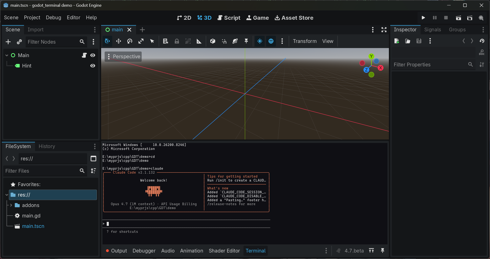
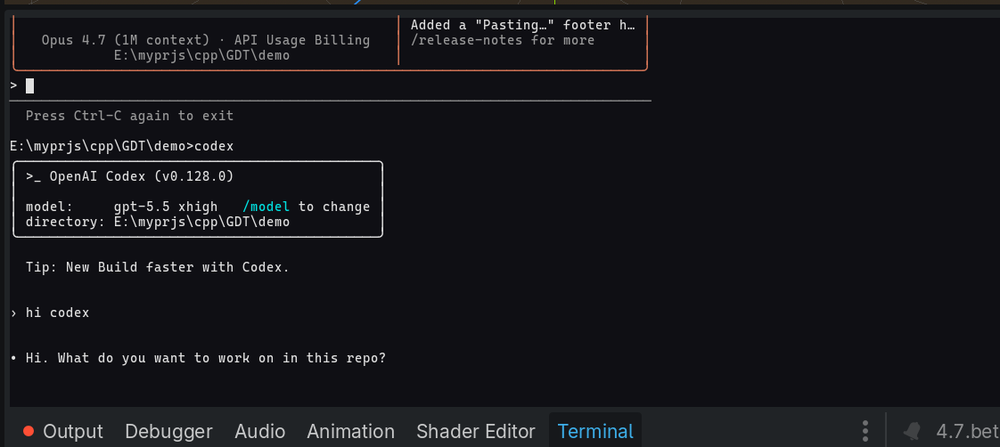

# godot-terminal

[English](README.md) · **中文**

> 在 Godot 编辑器中嵌入一个真正的终端 —— 无需离开引擎，就可以运行
> `cmd.exe`、`claude-code`、`codex` 或任何 TUI 命令行程序。

这是一个适用于 Godot 4.3+ 的 C++ GDExtension 插件。它会在 Godot 编辑器
底部面板中添加一个 **Terminal** 标签页。插件基于 libvterm，并为每个平台
配套了原生 PTY 后端（Windows 用 ConPTY，macOS / Linux 用 `forkpty`），
因此现代命令行工具，例如类 vim 程序、AI 编程助手、构建监听器、REPL 等,
可以像在你常用的终端里一样运行。

`Terminal` 类本身也是一个普通的 `Control` 节点，因此你也可以把它放进运行时场景中，
用来实现游戏内控制台或调试终端。

[](https://github.com/Azukibits/godot-terminal/actions/workflows/build.yml)



在同一个面板中切换 shell 和 TUI 工具 —— 不需要单独打开窗口，也不需要来回切换上下文：



## 功能特性

- 基于 **libvterm 0.3.3** 的真实 ANSI/xterm 终端模拟器
  （支持 truecolor、256 色、索引调色板、alt-screen、支持鼠标感知的程序）
- **跨平台 PTY**：Windows 用 ConPTY，macOS / Linux 用 `forkpty`
- 启动子进程（`cmd.exe`、`powershell.exe`、`bash`、`zsh`、
  `claude-code`、`codex` 等）
- **自动 resize**：列数 / 行数会按面板当前像素尺寸重新计算，
  并把新的尺寸转发给子进程，TUI 应用可以正确 reflow
- 完整键盘支持：方向键、`F1`–`F12`、`Ctrl/Alt` 组合键、`Tab`、
  `Esc`、`Backspace`、功能键
- **字形样式**：粗体（合成）、下划线、删除线 —— 按 cell 从 libvterm
  SGR 属性渲染
- **光标闪烁与形状**，由 `DECSCUSR` 控制（方块 / 下划线 / 竖线）；失去焦点时显示为空心方框
- **鼠标拖选 + 剪贴板**：拖动鼠标选中文本，**Ctrl+Shift+C** 复制、
  **Ctrl+Shift+V** 粘贴（兼容 bracketed paste）；中键也可粘贴
- 5000 行 **scrollback** 历史滚动，支持鼠标滚轮导航；键盘输入会自动回到底部实时视图
- 鼠标滚轮滚动；**Shift+滚轮** 按页滚动
- Shell 默认从当前打开的 **Godot 项目目录** 启动，
  因此 AI 编程工具可以直接看到正确的代码库

## 系统要求

- **Godot 4.3+**
- 以下任一平台：
  - **Windows 10 1809+**（ConPTY API）
  - **macOS 11+**（universal binary，x86_64 + arm64）
  - **Linux**（x86_64，glibc，使用 `libutil` 提供的 `forkpty`）

## 快速安装，推荐方式

1. 从 [Releases 页面](https://github.com/Azukibits/godot-terminal/releases)
   下载对应平台的压缩包：
   - Windows：`godot_terminal-vX.Y.Z-win64.zip`
   - macOS：`godot_terminal-vX.Y.Z-macos-universal.zip`
   - Linux：`godot_terminal-vX.Y.Z-linux-x86_64.zip`
2. 解压压缩包。将其中的 `godot_terminal/` 文件夹复制到你的 Godot 项目的
   `addons/` 目录中，最终路径应该是：
   `your_project/addons/godot_terminal/`。
3. 在 Godot 中打开：
   *Project → Project Settings → Plugins*，
   勾选 **godot_terminal** 启用插件。
4. 编辑器底部面板中会出现 **Terminal** 标签页
   （在 *Output*、*Debugger*、*Audio* 附近）。点击该面板并聚焦后即可输入命令。

## 故障排查

### Windows 下载后阻止 GDExtension DLL

如果你是从 `.zip` 压缩包安装插件，Windows 可能会把其中的 `.dll` 文件标记为
“来自互联网的文件”。这个标记叫做：

```text
Zone.Identifier / Mark-of-the-Web
```

出现这种情况时，即使插件文件位置正确，Godot 也可能无法加载 GDExtension DLL。

插件目录在 Godot 项目中应该类似这样：

```text
your_project/
└── addons/
    └── godot_terminal/
        └── bin/
            ├── godot_terminal.windows.template_debug.x86_64.dll
            └── godot_terminal.windows.template_release.x86_64.dll
```

要检查 DLL 是否被阻止，请先关闭 Godot，然后在 PowerShell 中运行下面的命令。
请将路径替换成你的真实项目路径：

```powershell
Get-Item "C:\path\to\your_project\addons\godot_terminal\bin\*.dll" | ForEach-Object {
    $z = Get-Item $_.FullName -Stream Zone.Identifier -ErrorAction SilentlyContinue
    "{0}  --  Zone: {1}" -f $_.Name, $(if ($z) { 'BLOCKED' } else { 'ok' })
}
```

如果 DLL 被阻止，会看到类似输出：

```text
godot_terminal.windows.template_debug.x86_64.dll  --  Zone: BLOCKED
godot_terminal.windows.template_release.x86_64.dll  --  Zone: BLOCKED
```

只解锁 DLL 文件：

```powershell
Unblock-File -Path "C:\path\to\your_project\addons\godot_terminal\bin\*.dll"
```

或者解锁整个插件目录：

```powershell
Get-ChildItem "C:\path\to\your_project\addons\godot_terminal" -Recurse | Unblock-File
```

解锁后可以再次检查：

```powershell
Get-Item "C:\path\to\your_project\addons\godot_terminal\bin\*.dll" | ForEach-Object {
    $z = Get-Item $_.FullName -Stream Zone.Identifier -ErrorAction SilentlyContinue
    "{0}  --  Zone: {1}" -f $_.Name, $(if ($z) { 'BLOCKED' } else { 'ok' })
}
```

正常情况下应该显示：

```text
godot_terminal.windows.template_debug.x86_64.dll  --  Zone: ok
godot_terminal.windows.template_release.x86_64.dll  --  Zone: ok
```

然后重新打开 Godot，并重新启用插件：

```text
Project → Project Settings → Plugins → godot_terminal
```

如果你还保留着原始下载的 `.zip` 文件，也可以先解锁压缩包再重新解压：

```powershell
Unblock-File -Path "C:\path\to\godot_terminal-vX.Y.Z-win64.zip"
```

然后重新解压到项目的 `addons/` 目录中。

> 只应解锁来自可信来源的文件，例如本仓库官方 Releases 页面下载的文件，
> 或者你自己从源码编译出来的文件。

## 从源码构建

适合想要修改插件，或者为尚未发布的 Godot 版本自行构建的开发者。

前置要求（所有平台共用）：

- Python 3.8+
- SCons 4.x，安装命令：`pip install scons`
- C++17 工具链：
  - **Windows**：Visual Studio 2019/2022，并安装 *Desktop development with C++* 工作负载
  - **macOS**：Xcode 命令行工具（`xcode-select --install`）
  - **Linux**：`gcc` / `clang`，以及系统的 `libutil` 头文件（一般随 glibc 安装）

```sh
git clone --recurse-submodules https://github.com/Azukibits/godot-terminal.git
cd godot-terminal

# Windows
scons platform=windows target=template_release arch=x86_64

# macOS（universal：x86_64 + arm64）
scons platform=macos target=template_release arch=universal

# Linux
scons platform=linux target=template_release arch=x86_64
```

构建生成的库文件会写入：

```text
demo/addons/godot_terminal/bin/
```

用 Godot 4.3+ 打开 `demo/` 即可测试内置 demo 项目。

在 Windows 上 SCons 通常会通过 `vswhere` 自动定位 MSVC。如果定位失败，
请从 *Developer Command Prompt for VS* 运行构建命令，或者先执行：

```bat
vcvarsall.bat amd64
```

## 在 GDScript 中使用

编辑器插件会自动在底部面板挂载一个 `Terminal` 实例。
你也可以在运行时自己创建一个：

```gdscript
var term := Terminal.new()
term.font_size = 14
term.size_flags_horizontal = Control.SIZE_EXPAND_FILL
term.size_flags_vertical = Control.SIZE_EXPAND_FILL
add_child(term)

# 启动一个 shell。cwd 为空表示继承当前目录；否则传入绝对路径。
# 根据当前 OS 选择对应的二进制。
match OS.get_name():
    "Windows": term.start_process("powershell.exe", [], "C:/path/to/your/project")
    "macOS":   term.start_process("/bin/zsh", ["-l"], "/path/to/your/project")
    _:         term.start_process("/bin/bash", ["-l"], "/path/to/your/project")

# 直接向子进程 stdin 写入文本。
term.send_input("ls -la\n")

# 连接进程生命周期信号。
term.process_exited.connect(func(code): print("exited: ", code))
```

部分 API 如下，完整内容见 [`src/terminal.h`](src/terminal.h)：

| 成员 | 用途 |
|------|------|
| `start_process(exe, args, cwd)` | 启动一个子进程并挂接到新建的 pty |
| `stop_process()` | 终止子进程并断开 PTY |
| `send_input(text)` / `send_input_bytes(data)` | 写入子进程 stdin |
| `write_text(s)` / `write_bytes(b)` | 直接向 VT 解析器注入字节，不经过 PTY |
| `cols` / `rows` | 终端字符网格大小；会按 Control 的尺寸自动重算 |
| `font` / `font_size` | 使用 `SystemFont` 或 `FontFile`；推荐使用等宽字体 |
| `scroll_to_bottom()` / `scroll_by(n)` / `clear_scrollback()` | 历史滚动视图控制 |
| `set_max_scrollback(n)` | 设置最大历史行数，默认 5000 行 |
| 信号：`process_started`、`process_exited(exit_code)` | 子进程生命周期信号 |

## 状态 / 路线图

当前已完成，`v0.3.0`：

- [x] GDExtension 框架，可在 Godot 4.3+ 加载
- [x] 基于 libvterm 的字符单元渲染，颜色和样式数据已打通
- [x] 跨平台 PTY：Windows ConPTY、macOS / Linux `forkpty`
- [x] 按 Control 像素尺寸自动重算列数 / 行数，并转发给子进程
- [x] 粗体（合成）、下划线、删除线字形渲染
- [x] 键盘输入映射，方向键、功能键、Ctrl/Alt 等
- [x] 光标闪烁与形状（方块 / 下划线 / 竖线），由 `DECSCUSR` 驱动
- [x] 鼠标拖选 + Ctrl+Shift+C/V 复制粘贴（兼容 bracketed paste）
- [x] Scrollback 历史滚动，5000 行，支持鼠标滚轮
- [x] Shell 的 `cwd` 默认设置为当前打开的 Godot 项目根目录

计划中的功能：

- [ ] 将鼠标按键转发给 TUI 应用，xterm mouse modes
- [ ] 斜体字形渲染（需要额外的 italic 字体或 canvas shear）
- [ ] OSC 0 / 2 窗口标题打通到 `title_changed` 信号
- [ ] `claude-code` / `codex` 兼容性专项处理，修复复杂 TUI 渲染暴露的问题

## 许可证

MIT — 见 [LICENSE](LICENSE)。

内置第三方代码：

- **[godot-cpp](https://github.com/godotengine/godot-cpp)** — MIT
  ，Godot Engine 项目
- **[libvterm 0.3.3](https://www.leonerd.org.uk/code/libvterm/)**，
  作者 Paul "LeoNerd" Evans — MIT，已 vendored 到 `thirdparty/libvterm/`
